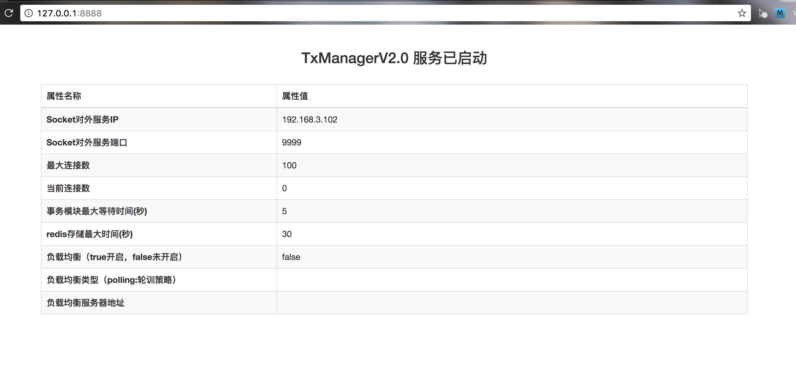
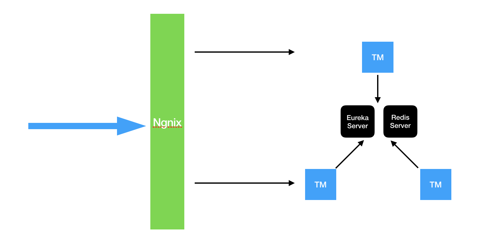

# TxManager(v2.1.1 高可用版本)
TxManager是LCN分布式事务框架的事务协调器，框架基于Netty做消息通讯，事务控制数据存储在Redis中。

## 使用教程
1. 启动redis服务


2. 配置application.properties文件（若配置文件与本机不一致或无法修改，请从源码install 创建jar）
```
#服务端口
server.port=8761
spring.application.name=tx-manager
spring.thymeleaf.prefix=classpath:/html/
spring.thymeleaf.suffix=.html

eureka.instance.prefer-ip-address=true
eureka.client.serviceUrl.defaultZone=http://127.0.0.1:8761/eureka/
eureka.client.registerWithEureka=true
eureka.client.fetchRegistry=false


#redis
#redis主机地址
spring.redis.hostName=127.0.0.1
#redis主机端口
spring.redis.port=6379
#redis链接密码
spring.redis.password=
spring.redis.pool.maxActive=10
spring.redis.pool.maxWait=-1
spring.redis.pool.maxIdle=5
spring.redis.pool.minIdle=0
spring.redis.timeout=0
#参与事务的最大等待时间（单位：秒） 所有参与分布式事务逻辑处理的最大等待时间
transaction_wait_max_time=5
#存储到redis下的数据最大保存时间（单位：秒）
redis_save_max_time=30
#socket server Socket对外服务端口
socket.port=9999
#socket ip Socket对外服务IP (主要：必须是外网访问地址)
socket.ip=192.168.3.101
# 最大socket连接数
socket.max.connection=100

```

3. 配置完成后 `java -jar tx-manager-2.1.0-SNAPSHOT.jar ` 。然后访问`http://127.0.0.1:8761` 正常如下：




## 高可用配置

原理图:



1. 配置Redis集群

2. 配置TM服务
部署多分tm，然后修改各个配置文件的eureka.client.serviceUrl.defaultZone，指向各服务的tm地址中间用"，"分割。

例如： http://192.168.1.101:8761/eureka/,http://192.168.1.102:8761/eureka/,http://192.168.1.103:8761/eureka/

3. 配置nginx负载均衡

负载均衡TM服务。

4. 修改各事务模块的tx.properties配置文件url地址参数为ngnix负载均衡的地址。

[tx-manager源码](https://github.com/1991wangliang/tx-lcn/tree/master/tx-manager) 


技术交流群：554855843